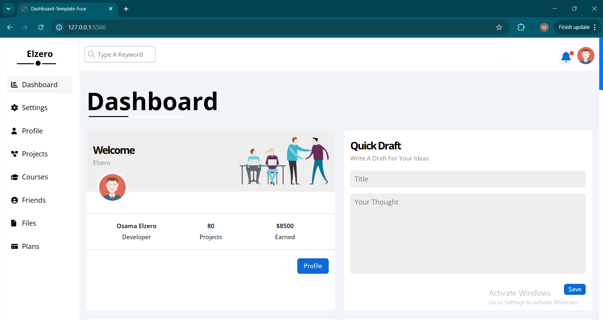

# Dashboard-Template-Four



Interactive and Responsive Dashboard With Milti Pages and More functionality in each page

---

## Live Demo

**[View Live Demo Here](https://mohammed-soliman144.github.io/Dashboard-Template-Four/)**

---

## Features:

**1-Responsive Design:** Works seamlessly on desktops, tablets and smart phones.

**2-Interactive UI:** Validating Form, Smoothly Scrolling and More Others.

**3-Animation UI:** Most of sections contains animation work smoothly.

**4-More Funactionality JS:** using localStorage, sessionStorage, location, to check is the same browser or not with Unique Identifier for each Browser.

---

## Technologies Used:

**1-HTML5**

**2-CSS3**

**3-JAVASCRIPT (ES6+)**

---

### How To Run Locally:

**Clone The Repo:**

```bash command
git clone https://github.com/mohammed-soliman144/Dashboard-Template-Four.git
```

**Navigate To The Project Directory:** `bash command cd Dashboard-Template-Four`

**Open 'index.html'** in your browser.

---

### Author:

**Mohammed Soliman**

**[Github Profile](https://github.com/mohammed-soliman144)**

**[Business Email](mohammed-soliman144@gmail.com)**

---

## License:

This Project is Licensed under the MIT License.
